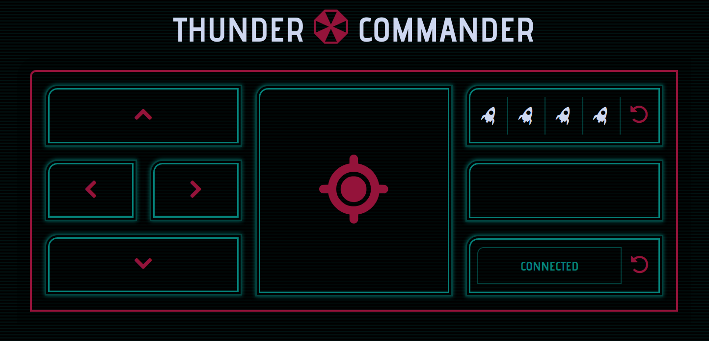

# Thunder Commander

Control your USB Thunder Missile Launcher with a web application based on [node](http://nodejs.org/), [express](http://expressjs.com) and [AngularJS](http://angularjs.org) in a web browser of your choice. 



## Install


### node

[Install node](http://nodejs.org/download/) if you don't have it.


### libusb
You need [libusb](http://www.libusb.org/) in order to install the dependencies.

#### Linux
```
sudo apt-get install build-essential pkg-config libusb-1.0-0-dev
```

#### Windows & Mac
Please contact me or create an issue if you need assistance.


### Clone the repository

```
git clone git@github.com:TimPietrusky/ThunderCommander.git
```


### Switch into the folder
```
cd ThunderCommander
```


### Get dependencies
#### Linux
```
sudo npm install
```
#### Windows & Mac
Please contact me or create an issue if you need assistance.


## Start the application
```
sudo node app
```

The application is now available under [http://localhost:1337](http://localhost:1337). If you want to change the port you have to edit the ```app.js``` file:

```javasript
// Listen on port for connection
app.listen(1337);
```


## Thunder Connector
In order to connect this web application with the real USB device I created the node module [thunder-connector](https://npmjs.org/package/thunder-connector). 


## The journey

At first I tried to create a Chrome App, but the [chrome.usb](http://developer.chrome.com/apps/usb.html) API is not allowed to call [USB-HID](http://en.wikipedia.org/wiki/USB_human_interface_device_class) devices, because the OS kernel grabs and interprets them before the user space code has a chance to do so. 

After that I tried to create a node application with the help of the [usb](https://npmjs.org/package/usb) package, but it has not access to USB-HID devices too D: 

That's why I started the third time from scratch with the [node-hid](https://github.com/node-hid/node-hid) package. But this time it worked :D


## Thanks

* Nathan Milford for creating [stormLauncher](https://github.com/nmilford/stormLauncher), because I copied the USB commando codes from his project
* Charley Drake from [Dream Cheeky](http://dreamcheeky.com), because he gave me the original Developer Manual for the [Thunder Missile Launcher](http://dreamcheeky.com/thunder-missile-launcher) 


## Author

2013 by [http://twitter.com/TimPietrusky](Tim Pietrusky)